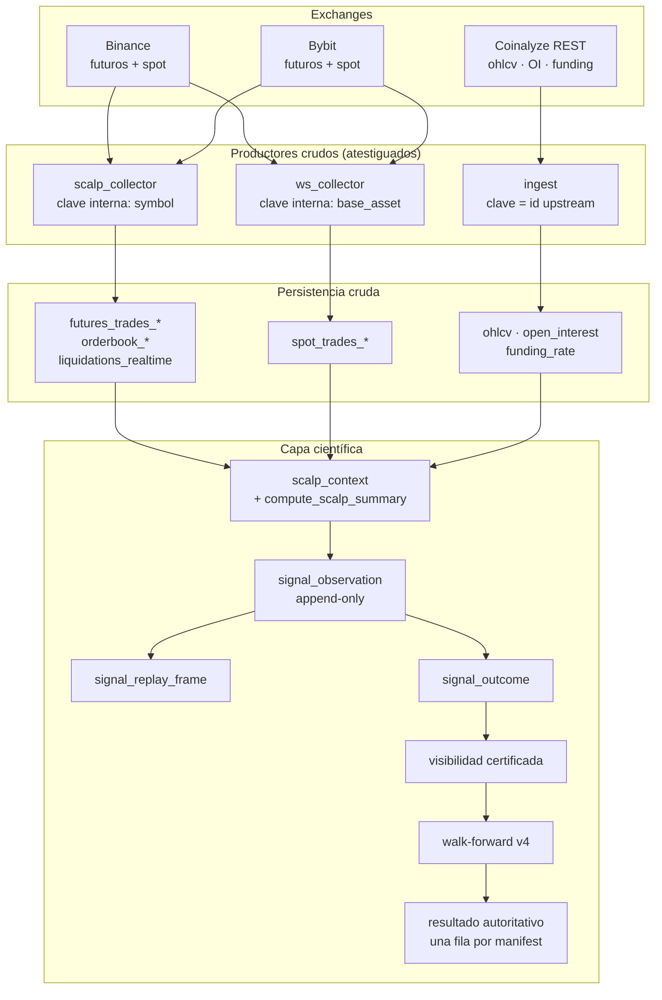
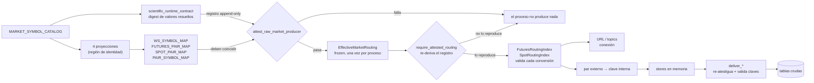
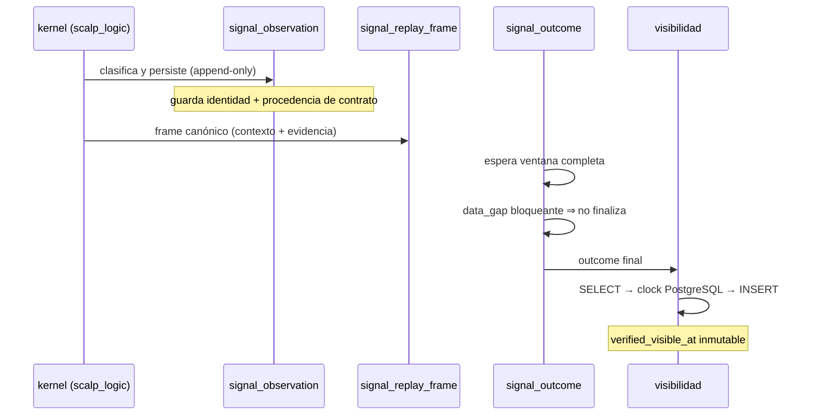
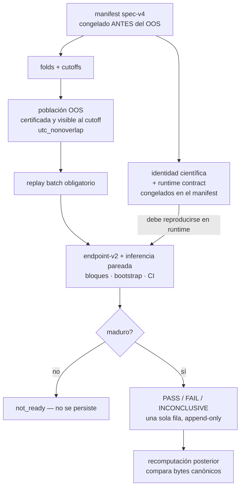
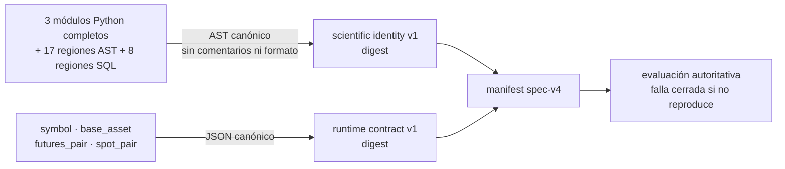
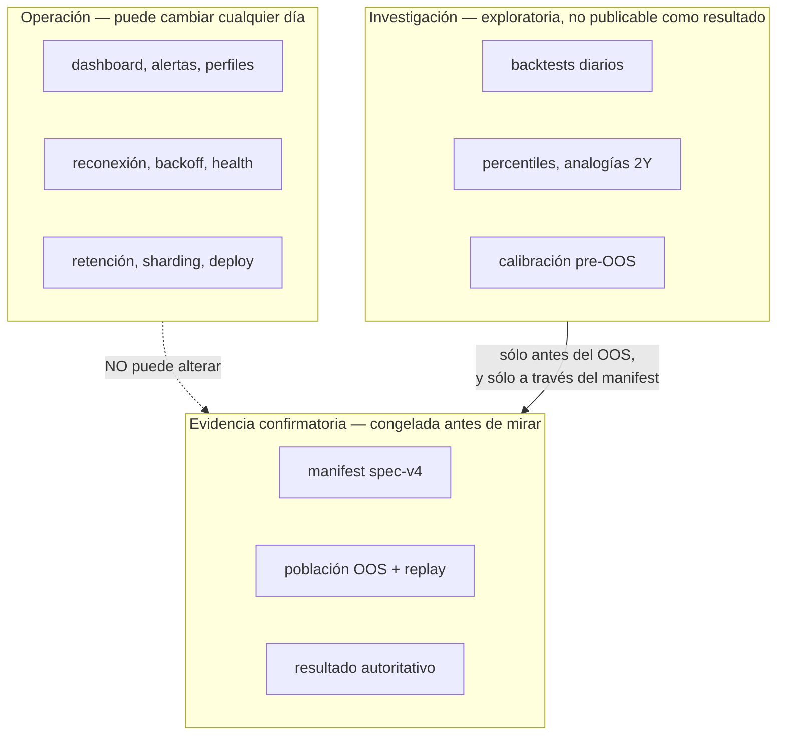

# Arquitectura científica

Cómo un tick de un exchange llega a ser —o no— evidencia confirmatoria. Este documento
describe **la arquitectura vigente en esta rama**, no un objetivo. Cada afirmación es
verificable contra el código; donde algo no existe todavía, se dice.

Léelo junto a [`PR27_CONFIRMATORY_ENDPOINT_INTEGRITY.md`](PR27_CONFIRMATORY_ENDPOINT_INTEGRITY.md),
que contiene el detalle formal, y [`HANDOFF_IA.md`](HANDOFF_IA.md), que dice qué está hecho.

## 1. La idea en una frase

Un resultado científico sólo vale si puedes demostrar **qué código lo calculó** y **qué
insumos crudos seleccionó**. Hashear la fuente responde lo primero; el contrato de runtime
responde lo segundo; y el ruteo atestiguado garantiza que el productor aplicó de verdad ese
contrato.

## 2. Vista general

`.A` en Coinalyze **es Binance**, no un agregado multi-venue. Ver `HANDOFF_IA.md` §2.

## 3. Ruteo atestiguado — el corazón de PR27

El colector no graba "el mercado ETH": graba lo que el ruteo diga, bajo una **clave
interna**. Si el ruteo miente, el kernel lee datos de otro mercado bajo la clave correcta y
nada en la fila lo delata.

Cinco barreras, cada una fail-closed:

| Barrera | Qué impide |
|---|---|
| Contrato registrado | Que el catálogo resuelto sea distinto del congelado. |
| Mapas vs. contrato | Que los dicts derivados diverjan del catálogo (hallazgo A-01). |
| Procedencia del ruteo | Que un `EffectiveMarketRouting` construido a mano —autoconsistente y portando el digest registrado como texto— llegue a producir un índice. |
| Índice ligado al ruteo | Que un índice forjado convierta un par externo en una clave interna ajena (hallazgo A-02). |
| `deliver_*` | Que una fila llegue al SQL con una clave fuera del ruteo atestiguado. |

La tercera barrera existe porque las dos primeras miran el *catálogo* y la cuarta mira la
*clave interna*, y ninguna de las dos cosas delata una sustitución del propio objeto de
ruteo. `require_attested_routing()` no compara el objeto consigo mismo: recomputa el contrato
desde la configuración viva y exige que reproduzca esas filas exactas. Eso también convierte
la barrera en un guardia continuo — un ruteo atestiguado al arrancar que después diverge
falla al construir el siguiente índice, antes de suscribirse.

**Qué está dentro de la identidad científica**: desde la corrección de ADR-012, los tres
módulos que deciden qué observan los colectores crudos están cubiertos **enteros** —
`app/scalp_collector.py`, `app/ws_collector.py` y `app/signal_runtime_contract.py`—, así que
la lista no hay que enumerarla: incluye por construcción imports, parsing, clasificación de
agresión, buckets, stores, colas, sesiones, loops, flush, delivery, creación de tareas y
entrypoints, además de las cuatro proyecciones de `app/config.py`, que sigue cubierto por
región.
**Qué queda fuera**: nada ejecutable de esos tres módulos. Reconexión, backoff, logging,
health de feeds, sleeps y parámetros de transporte WS **ya no son neutrales**: es el coste
aceptado y documentado de dejar de enumerar. Lo único insensible es la documentación —
comentarios, docstrings, líneas en blanco y formato—, por canonicalización AST. Ambas
direcciones están fijadas por tests de mutación.

El invariante, enunciado sin rodeos:

> Todo cambio capaz de alterar venue, suscripción, sesión, par externo, conversión a clave
> interna, entrada al store, ruteo por tarea o entrega raw debe **mover la identidad
> científica** o quedar **estructuralmente impedido** antes de suscribirse o escribir.

Las dos mitades son literales. La primera lo es por cobertura: los dos colectores se hashean
enteros, así que no existe «fuera» dentro de ellos. La segunda lo sigue siendo por estructura:
los bucles de reconexión y de flush reciben un `connect`/`cycle` ya ligado, `main()`/`run()`
no sostienen ningún `EffectiveMarketRouting`, y `require_attested_routing()` re-deriva el
contrato antes de construir cualquier índice. El barrido AST sobre `MATERIAL_SYMBOLS` se
conserva como **defensa adicional**, no como base de la propiedad: tres iteraciones
demostraron que una enumeración no puede sostenerla.

## 4. De observación a outcome

El replay recomputa la observación desde el frame y compara **campo a campo**. Cualquier
ausencia, versión no soportada, hash distinto o evidencia distinta levanta
`ConfirmatoryScientificIntegrityError` **dentro** de la transacción autoritativa, antes del
INSERT. No se convierte en cero ni en `INCONCLUSIVE`, y no se elimina del denominador.

## 5. Walk-forward confirmatorio y resultado autoritativo

El resultado se persiste **una vez**. `UPDATE`, `DELETE` y `TRUNCATE` están bloqueados por
triggers; un `CHECK` nativo recalcula el SHA-256 sobre los bytes UTF-8 del payload, así que
ni un INSERT SQL directo puede declarar un hash falso.

## 6. Las dos identidades y para qué sirve cada una

| | Identidad científica | Contrato de runtime |
|---|---|---|
| Responde | qué calcula el código | qué insumos seleccionó |
| Se calcula de | AST de 3 módulos completos + 25 regiones marcadas | valores resueltos del catálogo |
| Insensible a | comentarios, formato, docstrings, ubicación | orden y ortografía de `SYMBOLS` |
| Cambia si | cambia la semántica cubierta | cambia el ruteo resuelto |
| Registro | append-only por versión | append-only por versión |

Un commit Git **no** sirve como identidad: incluye cambios de UI y documentación que no
alteran el resultado.

## 7. Límites entre operación, investigación y evidencia confirmatoria

Reglas que sostienen la separación:

- Un cambio en OP **no debe** mover la identidad científica. Si la mueve, o está mal
  clasificado o la región es demasiado ancha (fue exactamente el caso de
  `whale_threshold_usd`). **Excepción vigente y deliberada (ADR-012)**: dentro de los tres
  módulos cubiertos enteros, la regla se suspende — backoff, logging y health sí mueven la
  identidad. Se aceptó porque la alternativa, mantener una superficie enumerada, fue refutada
  tres veces. Es una deuda a resolver antes de congelar identity-v1, no un estado final.
- Y al revés: un cambio material **no debe** poder ocurrir en OP. Si la única defensa es que
  nadie edite esa línea, la clasificación es aspiracional. Fue exactamente el caso de la
  selección de sesión dentro de los bucles de reconexión, que dos revisiones seguidas
  encontraron editable sin mover el digest.
- RES nunca escribe en las tablas de CONF. Sus parámetros entran sólo congelándolos en un
  manifest **antes** de que exista el periodo OOS.
- CONF no elige parámetros. PR27 instala la maquinaria; no selecciona símbolo, horizonte,
  MES, bloques, duración OOS, fees, cobertura ni settlement grace.

## 8. Fuera de alcance: Trade Tape / Footprint

`ESTADO: PLANNED — fuera de PR27.`

Hoy los trades se guardan como **agregados de 1 minuto y de 5 segundos**, así que no existe
footprint, volumen-a-precio real ni clusters de órdenes; el libro sólo llega a L1/L5/L10.
Una capa Trade Tape/Footprint requeriría persistencia tick a tick, su propio esquema, su
propia retención y su propia identidad científica.

**No forma parte de PR27 ni de la evidencia confirmatoria spec-v4.** Se registra como
iniciativa posterior en [`ROADMAP.md`](ROADMAP.md) §11 y como decisión en
[`ARCHITECTURE_DECISIONS.md`](ARCHITECTURE_DECISIONS.md). Cualquier trabajo en ella empieza
por un PR propio, después del resultado autoritativo.
